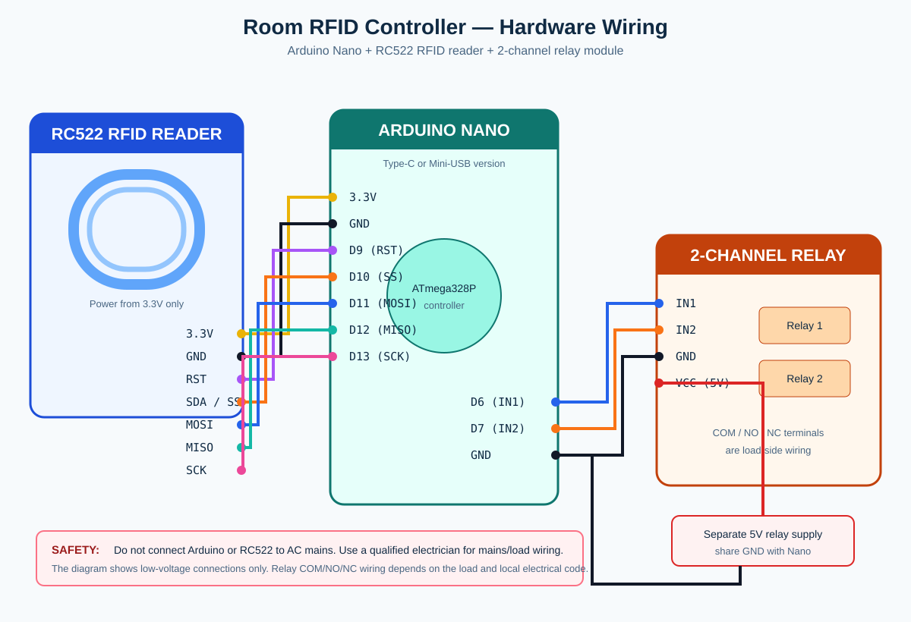

# Nano RFID two-relay controller

This Arduino Nano sketch saves every newly scanned RC522 RFID/NFC card UID in Arduino Nano EEPROM. A saved card toggles Relay 1 **ON** or **OFF**. Saved UIDs survive reset and power loss; Relay 1 itself starts OFF after reset or power loss.

## Wiring

This diagram shows only the low-voltage control wiring.

| RC522 | Arduino Nano |
| --- | --- |
| 3.3V | 3.3V |
| GND | GND |
| RST | D9 |
| SDA / SS | D10 |
| MOSI | D11 |
| MISO | D12 |
| SCK | D13 |

| Relay module | Arduino Nano |
| --- | --- |
| Relay 1 IN | D6 |
| Relay 2 IN | D7 |
| GND | GND (shared with Nano) |
| VCC | 5V relay supply, per module rating |

**Important:** Power the RC522 from **3.3V only**. Do not connect its signal pins to 5V. Relay modules and the load need an adequate separate power supply; share ground with the Nano where the relay module requires it.

## Mains electricity safety

The Nano and RC522 must never be connected directly to AC mains. The relay's `COM`/`NO` terminals may switch a mains-powered room circuit only if the relay is rated for the circuit's voltage, current, and load type, and it is installed in a proper insulated electrical enclosure with suitable fuse/breaker protection. Use a qualified electrician for any fixed building wiring. For higher-power loads, use the relay to control a correctly rated contactor rather than switching the load directly.

## Install and upload

1. In Arduino IDE, install **MFRC522** from Library Manager (author: GithubCommunity).
2. Open `rfid_dual_relay.ino`, select **Arduino Nano** and its processor/port, then upload.
3. Open Serial Monitor at **115200 baud** and scan each card.
4. Scan a card. Its UID is saved automatically and it immediately controls Relay 1.

The sketch assumes the common **active-LOW** relay modules. If yours turns on when it should be off, change `RELAY_ACTIVE_LOW` to `false`.

The sketch saves up to 80 card UIDs. Scan any card once to save it; scan it again to turn the room circuit ON or OFF. The card list is remembered after a power loss, but the relay state is not—Relay 1 starts OFF. To erase all saved cards, temporarily set `CLEAR_SAVED_CARDS_ON_BOOT` to `true`, upload the sketch once, then set it to `false` and upload again.

Because any new card is automatically approved, only use this mode in a trusted/private place.

## Notes on Android NFC

An Android phone will work only when it presents a compatible card type and stable UID. Many modern Android devices randomize or block exposing their NFC UID, so a physical MIFARE-compatible card/fob is the reliable choice. This sketch uses UID matching—not encrypted card authentication—so it is suitable for basic hobby access control, not high-security doors.
